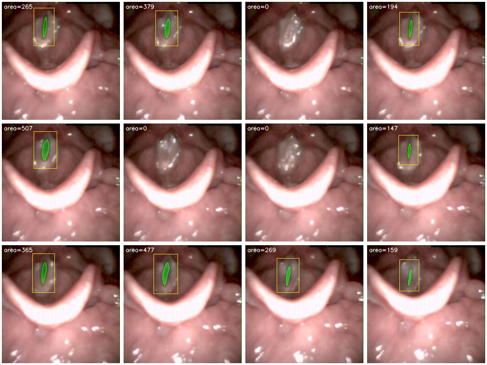

# OpenGlottal



Open-source toolkit for automated glottal area segmentation from high-speed videoendoscopy (HSV).

**Author:** Harikrishnan Unnikrishnan (hari@orchard-robotics.com)

OpenGlottal combines a YOLOv8 glottis detector, a U-Net pixel-level segmenter, and a temporal vocal fold tracker into a single, reproducible inference and training pipeline — trained and evaluated on the [GIRAFE dataset](https://zenodo.org/records/13773163) ([dataset paper](https://doi.org/10.1016/j.dib.2025.111376)) and [BAGLS](https://zenodo.org/records/3762320) ([Scientific Data, 2020](https://doi.org/10.1038/s41597-020-0526-3)).

---

## Pipelines

Five pipelines are provided (four YOLO-gated and one U-Net-only):

| Pipeline | Flag | Description |
|----------|------|-------------|
| **1 — VFT** | `vft` | YOLO detects the glottis → crop (size locked to first detection) → motion-based VocalFoldTracker |
| **2 — Guided VFT** | `guided-vft` | YOLO bbox as ROI mask on the full frame → YOLOGuidedVFT (no cropping) |
| **3 — YOLO+UNet** | `unet` | YOLO + full-frame U-Net: detection-gated (output only on frames where YOLO fires) |
| **4 — YOLO-Crop+UNet** | (eval only) | YOLO crop → resize to 256×256 → crop-trained U-Net → project mask back; use `--crop-weights` in `eval_girafe.py` / `eval_bagls.py` |
| **5 — U-Net only** | `unet-only` | Full-frame U-Net only, no YOLO gate (only `--unet-weights` required) |

All pipelines produce a per-frame **glottal area waveform** from which kinematic features (open quotient, fundamental frequency, periodicity, etc.) are extracted for downstream clinical analysis.

---

## Installation

Use a virtual environment in the repo so all commands use the same Python and dependencies.

```bash
git clone https://github.com/hari-krishnan/openglottal.git
cd openglottal
python3 -m venv .venv
source .venv/bin/activate   # Linux/macOS; on Windows: .venv\Scripts\activate
pip install -e ".[dev]"
```

From a local clone (venv already exists):

```bash
cd /path/to/openglottal
source .venv/bin/activate
pip install -e ".[dev]"    # only if you need to reinstall
```

**Always use this venv** for training, evaluation, and CLI: activate it (`source .venv/bin/activate`) before running any `python`/`openglottal` commands, or use the `./run` script (e.g. `./run scripts/train_unet.py ...`) which uses `.venv/bin/python` automatically.

*(A `pip install openglottal` option will work once the package is published to PyPI.)*

**Requirements:** Python ≥ 3.9, PyTorch ≥ 2.0, Ultralytics ≥ 8.0, OpenCV ≥ 4.8

**Weights:** Place pre-trained weights in `weights/` (or pass full paths to the scripts). Provided weights:

| Weights file | Description |
|--------------|-------------|
| `weights/openglottal_unet.pt` | GIRAFE-trained U-Net (full-frame, no crop) |
| `weights/openglottal_unet_cropped.pt` | GIRAFE-trained U-Net (crop mode; use with YOLO-Crop+UNet pipeline) |
| `weights/openglottal_unet_bagl_50epochs.pt` | BAGLS-trained U-Net (full-frame, no crop) |
| `weights/openglottal_yolo.pt` | GIRAFE-trained YOLO glottis detector |
| `weights/yolo_bagl_2_best.pt` | BAGLS-trained YOLO glottis detector |

To train your own, see [Training](#training); trained models are saved under `outputs/`.

---

## Quick Start

### Python API

```python
import torch
from openglottal import TemporalDetector, UNet, extract_features_unet

device = torch.device("mps")   # or "cuda" / "cpu"

detector = TemporalDetector("weights/openglottal_yolo.pt")

model = UNet(1, 1, (32, 64, 128, 256)).to(device)
model.load_state_dict(torch.load("weights/openglottal_unet.pt", map_location=device))
model.eval()

features = extract_features_unet("video.avi", detector, model, device)
print(features)
# {'area_mean': 312.4, 'area_std': 98.1, 'open_quotient': 0.61, 'f0': 0.017, ...}
```

### CLI

```bash
# U-Net pipeline (recommended)
openglottal run video.avi \
    --yolo-weights weights/openglottal_yolo.pt \
    --unet-weights weights/openglottal_unet.pt \
    --pipeline unet \
    --output results/

# Motion-based pipeline (no U-Net weights needed)
openglottal run video.avi \
    --yolo-weights weights/openglottal_yolo.pt \
    --pipeline guided-vft \
    --output results/
```

---

## Evaluation

### GIRAFE (4 test patients, 80 frames)

Compare against the GIRAFE paper baselines using GIRAFE-trained weights:

```bash
python scripts/eval_girafe.py \
    --images-dir       GIRAFE/Training/imagesTr \
    --labels-dir       GIRAFE/Training/labelsTr \
    --training-json    GIRAFE/Training/training.json \
    --unet-weights     weights/openglottal_unet.pt \
    --yolo-weights     weights/openglottal_yolo.pt \
    --device           mps
```

Results are printed alongside the published GIRAFE baselines for direct comparison.  Pass `--output-json results.json` to save raw per-frame scores.

### Results (GIRAFE test split, 4 patients, 80 frames)

| Method | Det.Recall | Dice | IoU | Dice≥0.5 |
|--------|-----------|------|-----|----------|
| InP (GIRAFE paper) | n/a | 0.71 | n/a | n/a |
| U-Net (GIRAFE paper) | n/a | 0.64 | n/a | n/a |
| SwinUNetV2 (paper) | n/a | 0.62 | n/a | n/a |
| **U-Net only** | n/a | **0.81** | **0.70** | **96.2%** |
| OTSU (baseline) | 0.95 | 0.22 | 0.13 | 2.5% |
| YOLO+UNet | 0.95 | 0.75 | 0.64 | 88.8% |
| YOLO-Crop+UNet† | 0.95 | 0.70 | 0.57 | 77.5% |
| Motion (baseline) | 0.95 | 0.27 | 0.17 | 9.7% |

- **Det.Recall** — fraction of frames where YOLO detected a glottis
- **Dice** — mean Dice coefficient across all test frames (higher is better)
- **Dice≥0.5** — fraction of frames meeting the clinical pass threshold

† YOLO-Crop+UNet uses the crop-trained U-Net: `weights/openglottal_unet_cropped.pt`. Full-frame and crop weight files are not interchangeable.

YOLO+Motion underperforms because GIRAFE test frames are the first 20 frames per patient, providing insufficient temporal context for the motion tracker to converge.

### BAGLS zero-shot (3 500 test frames, GIRAFE-trained only)

No BAGLS data used in training. Use GIRAFE-trained weights; images are letterboxed to 256×256.

```bash
python scripts/eval_bagls.py \
    --bagls-dir    BAGLS/test \
    --unet-weights weights/openglottal_unet.pt \
    --crop-weights weights/openglottal_unet_cropped.pt \
    --yolo-weights weights/openglottal_yolo.pt \
    --device       mps
```

| Method | Det.Recall | Dice | IoU | Dice≥0.5 |
|--------|-----------|------|-----|----------|
| U-Net only | 1.00 | 0.59 | 0.50 | 67.1% |
| YOLO+UNet | 0.69 | 0.55 | 0.47 | 61.9% |
| **YOLO-Crop+UNet** | **0.69** | **0.61** | **0.53** | **70.3%** |

*(Table at default confidence $\tau=0.25$. With `--conf 0.02`, YOLO-Crop+UNet reaches Dice 0.64 and Dice≥0.5 76.4%; see paper and `sweep_bagls_conf.py`.)*

YOLO-Crop+UNet is the strongest pipeline on the unseen BAGLS data (+2 pp Dice, +3.2 pp Dice≥0.5 over U-Net alone at default $\tau$; at $\tau=0.02$, +5 pp Dice and +9.3 pp Dice≥0.5), despite YOLO only detecting on 68.8% of frames (domain shift from GIRAFE).  When YOLO does fire, cropping and re-scaling the region of interest gives U-Net higher effective resolution and cleaner context — benefits that generalise across datasets.

### BAGLS in-distribution (3 500 test frames, BAGLS-trained weights)

Use the provided BAGLS-trained U-Net and YOLO weights:

```bash
python scripts/eval_bagls.py \
    --bagls-dir    BAGLS/test \
    --unet-weights weights/openglottal_unet_bagl_50epochs.pt \
    --crop-weights weights/openglottal_unet_cropped.pt \
    --yolo-weights weights/yolo_bagl_2_best.pt \
    --device       mps
```

On the 3 500-frame BAGLS test set this configuration achieves:

| Method             | Det.Recall | Dice  | IoU   | Dice≥0.5 |
|--------------------|-----------:|------:|------:|---------:|
| **U-Net only**     | 1.00       | 0.85  | 0.77  | 94.0%    |
| **YOLO+UNet**      | 0.87       | **0.85**  | **0.78**  | **94.6%** |
| YOLO-Crop+UNet     | 0.87       | 0.74  | 0.64  | 87.1%    |

So BAGLS-trained YOLO+UNet sets a strong in-distribution baseline (Dice 0.85), while the zero-shot GIRAFE-trained YOLO-Crop+UNet remains the best cross-dataset configuration.

---

## Training

### 1. Build the YOLO dataset

```bash
openglottal build-dataset \
    --images-dir  GIRAFE/Training/imagesTr \
    --labels-dir  GIRAFE/Training/labelsTr \
    --training-json GIRAFE/Training/training.json \
    --output-dir  yolo_data
```

Or via script:

```bash
python scripts/train_yolo.py \
    --images-dir  GIRAFE/Training/imagesTr \
    --labels-dir  GIRAFE/Training/labelsTr \
    --training-json GIRAFE/Training/training.json \
    --epochs 100
```

YOLO saves best weights to `outputs/yolo/exp/weights/best.pt` (default run name `exp`). Use that path for `train_unet_crop.py` below, or copy to `outputs/openglottal_yolo.pt` for eval/CLI.

### 2. Train the U-Net (full-frame mode)

```bash
python scripts/train_unet.py \
    --images-dir  GIRAFE/Training/imagesTr \
    --labels-dir  GIRAFE/Training/labelsTr \
    --training-json GIRAFE/Training/training.json \
    --output outputs/openglottal_unet.pt \
    --epochs 50
```

### 3. Train the U-Net (YOLO-crop mode — higher effective resolution)

Uses YOLO to crop each training image to the glottis region, resizes to 256×256, and trains U-Net on these patches.  At inference time the YOLO-Crop+UNet pipeline crops the input, runs U-Net, and projects the mask back to full-frame coordinates.

```bash
python scripts/train_unet_crop.py \
    --images-dir    GIRAFE/Training/imagesTr \
    --labels-dir    GIRAFE/Training/labelsTr \
    --training-json GIRAFE/Training/training.json \
    --yolo-weights  outputs/yolo/exp/weights/best.pt \
    --output        outputs/openglottal_unet_crop.pt \
    --crop-size     256 \
    --epochs        50 \
    --device        cpu
```

**Device:** Use `--device cuda` on Kaggle or a GPU machine. On Mac, use `--device cpu` for training (MPS is not used for training); use `--device mps` for evaluation (`eval_bagls.py`, `eval_girafe.py`, `analyze_gaw.py`) for faster inference.

Both training modes use a **50/50 BCE + Dice loss** with cosine annealing, saving the best validation checkpoint automatically.

---

## Repository Structure

```
openglottal/
├── weights/                 # pre-trained weights (see table above)
├── outputs/                 # trained models (gitignored) when training your own
├── openglottal/
│   ├── models/
│   │   ├── detector.py     # TemporalDetector — YOLOv8 + temporal box locking
│   │   ├── tracker.py      # VocalFoldTracker, YOLOGuidedVFT
│   │   └── unet.py         # UNet, DoubleConv, GlottisDataset (with augmentation)
│   ├── features.py         # extract_features_{detector,yolo_guided_vft,unet}
│   ├── data.py             # mask_to_yolo, build_yolo_dataset
│   ├── utils.py            # I/O helpers, dice/IoU metrics, unet_segment_frame
│   └── cli.py              # `openglottal` command-line interface
├── scripts/
│   ├── train_yolo.py       # standalone YOLO training script
│   ├── train_unet.py       # standalone U-Net training script
│   ├── infer.py            # batch inference: AVI dir or image sequence → _out.avi
│   ├── eval_girafe.py      # per-patient test evaluation vs GIRAFE baselines
│   ├── eval_bagls.py       # cross-dataset evaluation on BAGLS (3 500 frames)
│   ├── analyze_gaw.py      # GAW feature analysis: Healthy vs Pathological (65 patients)
│   ├── download_datasets.py # download GIRAFE and BAGLS from Zenodo
│   ├── prepare_girafe_splits.py  # build GIRAFE training.json from images/labels
│   ├── prepare_bagls_splits.py   # build BAGLS train/test splits
│   ├── make_montage.py     # build frame montage PNGs for paper figures
│   ├── sweep_bagls_conf.py # YOLO confidence threshold sweep on BAGLS
│   └── train_unet_crop.py  # train U-Net on YOLO-cropped patches (higher res)
└── configs/
    └── default.yaml        # all hyperparameters documented in one place
```

---

## Dataset

OpenGlottal is developed and evaluated on **GIRAFE** and **BAGLS**. Download them (optional: use the script) then point the training/eval scripts at the extracted directories.

```bash
# Download GIRAFE and/or BAGLS to the current directory (or use --output-dir)
python scripts/download_datasets.py --girafe --bagls
```

- **GIRAFE** (Zenodo): [zenodo.org/records/13773163](https://zenodo.org/records/13773163) — 760 frames (256×256 px), expert-annotated glottal masks. Dataset paper: [Data in Brief (2025)](https://doi.org/10.1016/j.dib.2025.111376). After unpacking: `GIRAFE/Training/imagesTr/`, `GIRAFE/Training/labelsTr/`, `GIRAFE/Training/training.json`; raw videos: `GIRAFE/Raw_Data/`. If you have a copy in `./sdsc/glottal_area`, copy it over then run the prepare script:

  ```bash
  mkdir -p GIRAFE/Training && cp -r sdsc/glottal_area/imagesTr sdsc/glottal_area/labelsTr GIRAFE/Training/
  python scripts/prepare_girafe_splits.py --images-dir GIRAFE/Training/imagesTr --labels-dir GIRAFE/Training/labelsTr --output GIRAFE/Training/training.json
  ```
- **BAGLS** (Zenodo): [zenodo.org/records/3762320](https://zenodo.org/records/3762320) — benchmark for automatic glottis segmentation. Dataset paper: [Gómez et al., Scientific Data (2020)](https://doi.org/10.1038/s41597-020-0526-3). After downloading with `download_datasets.py --bagls`, use `BAGLS/test` as `--bagls-dir` for eval and `BAGLS/training` for training.

| Split (GIRAFE) | Frames |
|----------------|--------|
| Train | ~608 |
| Val | ~76 |
| Test | ~76 |

---

## Kinematic Features

The following scalar features are extracted from each glottal area waveform:

| Feature | Description |
|---------|-------------|
| `area_mean` | Mean glottal area (px²) |
| `area_std` | Standard deviation of area |
| `area_range` | Max − min area |
| `open_quotient` | Fraction of cycle with area above 10 % of mean |
| `f0` | Dominant frequency from FFT (cycles/frame; multiply by capture fps for Hz) |
| `periodicity` | Peak autocorrelation at lags 1–50 |
| `cv` | Coefficient of variation (std / mean) |

---

## Glottal Area Waveform Analysis

Beyond frame-level segmentation, the pipeline produces a **Glottal Area Waveform (GAW)** — the per-frame glottal area over time — from which kinematic features can be extracted and used for clinical classification.

```bash
python scripts/analyze_gaw.py \
    --raw-data-dir  GIRAFE/Raw_Data \
    --yolo-weights  weights/openglottal_yolo.pt \
    --unet-weights  weights/openglottal_unet.pt \
    --device        mps \
    --output-dir    results/gaw
```

This script processes all 65 GIRAFE patients, extracts kinematic features from each area waveform, and compares **Healthy** vs **Pathological** groups using Mann-Whitney U tests.

### Key Findings (65 patients: 15 Healthy, 25 Pathological, 25 Unknown)

Because the cohort has a significant sex imbalance (see note below), results are reported **stratified by sex** rather than pooled.

**Female subgroup (12 H / 11 P):**

| Feature | Healthy (mean±std) | Pathological (mean±std) | p-value |
|---------|-------------------|------------------------|---------|
| area_mean | 125.2 ± 43.1 | 247.8 ± 204.6 | 0.230 |
| area_std | 112.9 ± 32.2 | 118.9 ± 96.0 | 0.406 |
| area_range | 336.7 ± 97.6 | 375.5 ± 272.2 | 0.559 |
| open_quotient | 0.760 ± 0.207 | 0.874 ± 0.131 | 0.192 |
| f0 | 241.7 ± 34.8 Hz | 203.5 ± 73.6 Hz | 0.156 |
| periodicity | 0.955 ± 0.008 | 0.946 ± 0.013 | 0.255 |
| cv | **0.95 ± 0.20** | **0.57 ± 0.29** | **0.006*** |

**Male subgroup (3 H / 14 P):**

| Feature | Healthy (mean±std) | Pathological (mean±std) | p-value |
|---------|-------------------|------------------------|---------|
| area_mean | 192.1 ± 18.3 | 172.7 ± 94.0 | 0.768 |
| area_std | 142.7 ± 35.0 | 92.0 ± 66.9 | 0.197 |
| area_range | 439.7 ± 86.7 | 343.1 ± 212.3 | 0.488 |
| open_quotient | 0.860 ± 0.145 | 0.843 ± 0.186 | 1.000 |
| f0 | 183.3 ± 75.0 Hz | 82.5 ± 79.3 Hz | 0.169 |
| periodicity | 0.962 ± 0.001 | 0.900 ± 0.116 | 0.068 |
| cv | 0.75 ± 0.19 | 0.63 ± 0.40 | 0.509 |

\* p < 0.05 (Mann-Whitney U, two-sided)

> **Sex imbalance note:** The Healthy group is 80% female (12F/3M) while the Pathological group is 56% male (14M/11F; Fisher's exact p=0.025). Because f0 is strongly sex-dependent (males ~100 Hz vs females ~224 Hz), pooling would confound f0. After stratifying, only **cv** (coefficient of variation) reaches significance in the female subgroup (p=0.006). In the male subgroup (n=3 Healthy), cv trends in the same direction (0.75 vs 0.63) but does not reach significance (p=0.509); periodicity approaches significance (p=0.068). The male subgroup is too small for reliable inference.

### Production Robustness

YOLO acts as a **detection gate**: when the endoscope moves away from the glottis (scope insertion, patient coughing, instrument in view), YOLO fires no detection and the area is set to zero — preventing spurious waveform spikes that would corrupt downstream feature extraction.

---

## Citation

If you use OpenGlottal in your research, please cite:

```bibtex
@article{unnikrishnan2026openglottal,
  title   = {Detection-gated glottal segmentation with zero-shot cross-dataset
             transfer and clinical feature extraction},
  author  = {Unnikrishnan, Harikrishnan},
  journal = {Computers in Biology and Medicine},
  year    = {2026},
  note    = {Submitted to Computers in Biology and Medicine}
}
```

Related prior work on glottal kinematics and high-speed imaging:

```bibtex
@article{patel2013invivo,
  title   = {In vivo measurement of pediatric vocal fold motion using
             structured light laser projection},
  author  = {Patel, Rita R and Donohue, Kevin D and Lau, Daniel and
             Unnikrishnan, Harikrishnan},
  journal = {The Laryngoscope},
  year    = {2013}
}

@article{patel2016effects,
  title   = {Effects of vocal fold nodules on glottal cycle measurements
             derived from high-speed digital imaging},
  author  = {Patel, Rita R and Unnikrishnan, Harikrishnan and Donohue, Kevin D},
  journal = {Journal of Speech, Language, and Hearing Research},
  year    = {2016}
}
```

---

## License

MIT License — see [LICENSE](LICENSE).
